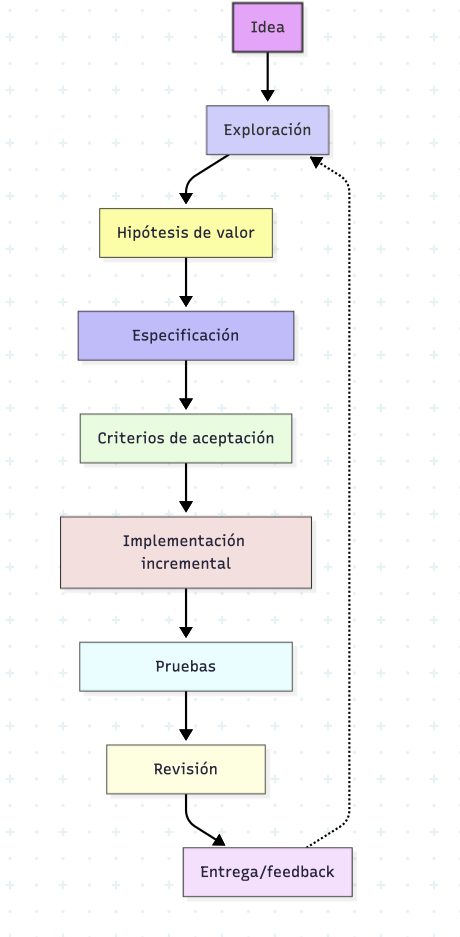
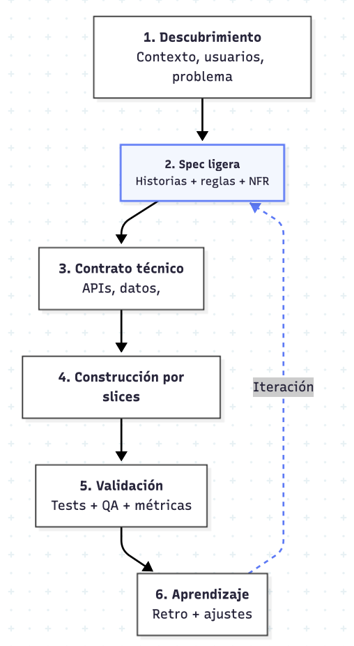
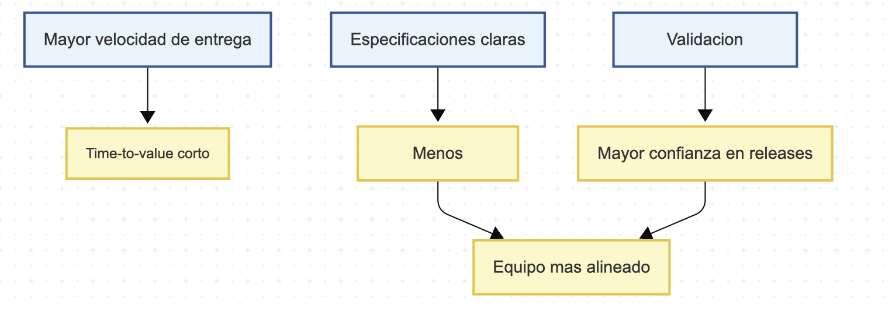
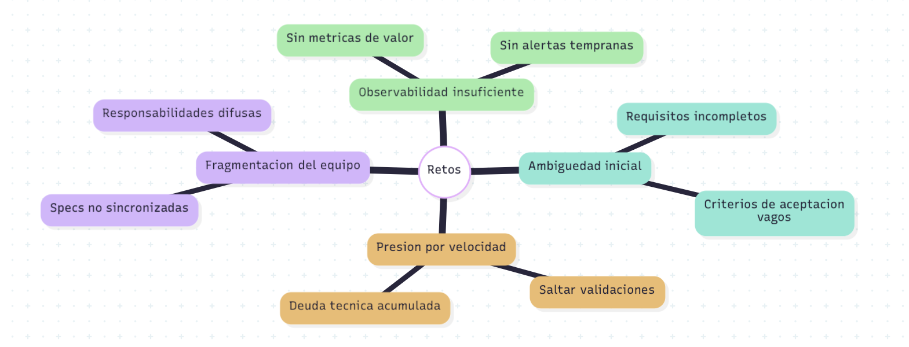
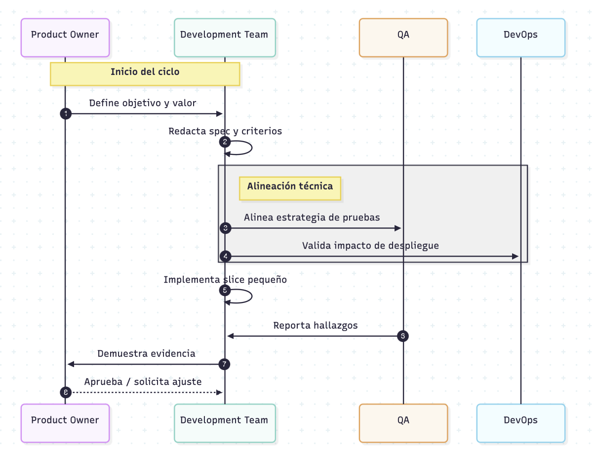

# Vibe Coding + Spec-Driven Development

## Objetivo
Este documento propone una forma de trabajo que combina:
- **Vibe Coding**: velocidad, exploración y creatividad con ciclos cortos.
- **Spec-Driven Development (SDD)**: diseño guiado por especificaciones verificables antes de construir.

La meta es mantener un equilibrio entre **flujo creativo** y **calidad técnica sostenible**.

## 1) Mapa General del Enfoque

## 2) Flujo Operativo Recomendado

## 3) Prácticas Clave

| Práctica | Cómo se aplica | Resultado esperado |
|---|---|---|
| Specs vivas | Cada historia incluye alcance, exclusiones, riesgos y criterios de aceptación | Menos ambigüedad y retrabajo |
| PRs pequeñas | Cambios por capability, no por capa técnica | Revisiones más rápidas y seguras |
| Feature toggles | Activación progresiva por entorno o grupo | Menor riesgo en despliegue |
| Quality gates | Lint, tests, cobertura y revisión de deuda técnica | Estabilidad continua |
| Bucle de feedback | Métricas de uso + errores + tiempo de ciclo | Mejora iterativa real |

## 4) Ventajas

1. Entregas frecuentes con menor incertidumbre.
2. Menor costo de cambio gracias a specs y tests.
3. Mejor comunicación entre negocio, producto y desarrollo.
4. Trazabilidad clara desde idea hasta evidencia de validación.

## 5) Retos y Riesgos

### Mitigaciones sugeridas
- Definir plantilla mínima de spec por historia.
- Exigir Definition of Done con pruebas y criterios no funcionales.
- Programar revisiones de arquitectura livianas pero periódicas.
- Medir lead time, defectos en producción y retrabajo por sprint.

## 6) Matriz de Decisión (Cuándo usar más Vibe o más SDD)

| Escenario | Intensidad Vibe Coding | Intensidad SDD | Recomendación |
|---|---|---|---|
| Prototipo temprano | Alta | Media | Experimentar rápido y capturar hallazgos en specs breves |
| Feature crítica | Media | Alta | Priorizar contratos, pruebas y validación formal |
| Refactor estructural | Baja-Media | Alta | Diseñar primero para evitar regresiones |
| Bug urgente en producción | Media | Media-Alta | Fix rápido con prueba de no regresión obligatoria |

## 7) Flujo de Gobernanza Ligera

## 8) Recomendaciones de Adopción

1. Iniciar con un piloto de 2 a 3 épicas y medir resultados.
2. Estandarizar una plantilla única de spec (objetivo, alcance, NFR, criterios, riesgos).
3. Integrar validaciones automáticas en CI para cada pull request.
4. Revisar semanalmente deuda técnica y señales de sobrecarga de flujo.

## 9) Conclusión

Combinar Vibe Coding con Spec-Driven Development permite maximizar creatividad sin perder control de calidad. El equilibrio correcto no es fijo: depende de criticidad, contexto y madurez del equipo. La clave es mantener ciclos cortos de aprendizaje con evidencia verificable en cada entrega.
